# Programación Orientada a Objetos

Esta asignatura aporta al perfil del Ingeniero la capacidad de analizar, desarrollar, implementar y administrar software de aplicación orientado a objetos, cumpliendo con estándares de calidad, con el fin de apoyar la productividad y competitividad de las organizaciones.

## Contenido

- [Plan de trabajo](#plan-de-trabajo)
- [Unidad 1: Introducción al paradigma de la Programación Orientada a Objetos](#unidad-1-introducción-al-paradigma-de-la-programación-orientada-a-objetos)
  - [1.1 Elementos del modelo de objetos: clases, objetos, abstracción, modularidad, encapsulamiento, herencia y polimorfismo.](#11-elementos-del-modelo-de-objetos-clases-objetos-abstracción-modularidad-encapsulamiento-herencia-y-polimorfismo)
  - [1.2 Lenguaje de modelado unificado: diagrama de clases](#12-lenguaje-de-modelado-unificado-diagrama-de-clases)
- [Unidad 2: Clases y Objetos](#unidad-2-clases-y-objetos)
  - [2.1 Declaración de clases: atributos, métodos, encapsulamiento](#21-declaración-de-clases-atributos-métodos-encapsulamiento)
  - [2.2 Instanciación de una clase](#22-instanciación-de-una-clase)
  - [2.3 Referencia al objeto actual](#23-referencia-al-objeto-actual)
  - [2.4 Métodos: declaración, mensajes, paso de parámetros, retorno de valores](#24-métodos-declaración-mensajes-paso-de-parámetros-retorno-de-valores)
  - [2.5 Constructores y destructores declaración, uso y aplicaciones](#25-constructores-y-destructores-declaración-uso-y-aplicaciones)
  - [2.6 Sobrecarga de métodos](#26-sobrecarga-de-métodos)
  - [2.7 Sobrecarga de operadores: Concepto y utilidad, operadores unarios y binarios](#27-sobrecarga-de-operadores-concepto-y-utilidad-operadores-unarios-y-binarios)
- [Unidad 3: Herencia](#unidad-3-herencia)
  - [3.1 Definición: Clase base, Clase derivada](#31-definición-clase-base-clase-derivada)
  - [3.2 Clasificación: herencia simple, herencia múltiple](#32-clasificación-herencia-simple-herencia-múltiple)
  - [3.3 Reutilización de miembros heredados](#33-reutilización-de-miembros-heredados)
  - [3.4 Referencia al objeto de la clase base](#34-referencia-al-objeto-de-la-clase-base)
  - [3.5 Constructores y destructores en clases derivadas](#35-constructores-y-destructores-en-clases-derivadas)
  - [3.6 Redefinición de métodos en clases derivadas](#36-redefinición-de-métodos-en-clases-derivadas)
- [Unidad 4: Polimorfismo](#unidad-4-polimorfismo)
  - [4.1 Definición](#41-definición)
  - [4.2 Clases abstractas: definición, métodos abstractos, implementación de clases abstractas, modelado de clases abstractas](#42-clases-abstractas-definición-métodos-abstractos-implementación-de-clases-abstractas-modelado-de-clases-abstractas)
  - [4.3 Interfaces: definición, implementación de interfaces, herencia de interfaces](#43-interfaces-definición-implementación-de-interfaces-herencia-de-interfaces)
  - [4.4 Variables polimórficas (plantillas): definición, uso y aplicaciones](#44-variables-polimórficas-plantillas-definición-uso-y-aplicaciones)
  - [4.5 Reutilización de código](#45-reutilización-de-código)
- [Unidad 5: Excepciones](#unidad-5-excepciones)
  - [5.1 Definición](#51-definición)
  - [5.2 Tipos de excepciones](#52-tipos-de-excepciones)
  - [5.3 Propagación de excepciones](#53-propagación-de-excepciones)
  - [5.4 Gestión de excepciones: manejo de excepciones, lanzamiento de excepciones](#54-gestión-de-excepciones-manejo-de-excepciones-lanzamiento-de-excepciones)
  - [5.5 Creación y manejo de excepciones definidas por el usuario](#55-creación-y-manejo-de-excepciones-definidas-por-el-usuario)
- [Unidad 6: Flujos y archivos](#unidad-6-flujos-y-archivos)
  - [6.1 Definición](#61-definición)
  - [6.2 Clasificación: Archivos de texto y binarios](#62-clasificación-archivos-de-texto-y-binarios)
  - [6.3 Operaciones básicas y tipos de acceso](#63-operaciones-básicas-y-tipos-de-acceso)
  - [6.4 Manejo de objetos persistentes](#64-manejo-de-objetos-persistentes)
- [Anexos](#anexos)
  - [Tabla comparativa de Lenguajes de Programación](#tabla-comparativa-de-lenguajes-de-programación)

## Plan de trabajo

Los detalles de la materia así como el plan de trabajo pueden ser consultados en el siguiente [documento](https://www.delicias.tecnm.mx/doc/Oferta_Educativa/Sistemas/2Semestre/ProgramacionOrientadaaObjetos.pdf).

### Requisitos para tomar la materia

- Equipo de cómputo
- Conexión a Internet
- Cuenta de Github
- Instalar editor de código (VSCode recomendable)

### Criterios de Evaluación

- Examen 50%
- Prácticas y tareas 40% (Cada práctica/tarea tendrá criterios específicos)
- Asistencia y puntualidad 10%

> :eyes: Nota: Para tener derecho al examen deberá contar con todas las prácticas/tareas realizadas y entregadas en tiempo y forma

### Material de apoyo

- [Taller de Git](https://github.com/DevelopersDelicias/git-workshop-2021/tree/main)
- [Canal de YouTube](https://www.youtube.com/@benjamincisneros797/videos)
- [Dev Docs](https://devdocs.io/)

## Unidad 1: Introducción al paradigma de la programación orientada a objetos

En esta unidad se presentan los conceptos de la programación orientada a objetos, teniendo la intención de introducir al estudiante en los elementos del modelo de objetos, así como el uso básico del lenguaje de modelado unificado.

### 1.1 Elementos del modelo de objetos: clases, objetos, abstracción, modularidad, encapsulamiento, herencia y polimorfismo.

La Programación Orientada a Objetos (POO) es un paradigma de programación enfocado en representar los objetos del mundo real y de este modo simular de una manera más precisa las diferentes necesidades de un sistema o aplicación.

Un **objeto** puede representar tanto elementos físicos (carro, producto, etc..), personas (usuario, estudiante, etc..) o incluso conceptos abstractos resultantes de la interacción de los usuarios con el sistema (venta, compra, pedido, etc..).

Una **clase** sirve como una plantilla de la cual se definen las características (atributos) y operaciones (métodos) que los objetos que pertenecen a dicha clase pueden contener.


Por ejemplo, la clase `Automovil` puede contener los atributos `marca`, `modelo`, `tipoDeTransmision`, etc.., y los métodos `arrancar`, `acelerar`, `frenar`, etc...

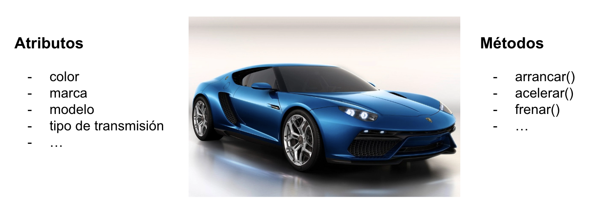

Dependiendo del contexto del sistema a desarrollar, los atributos y métodos pueden variar en número y complejidad, ya que es posible que una clase defina atributos de otras clases. Por ejemplo, en algunos sistemas, bastará con que el atributo motor sea una simple cadena de texto, pero en otros un objeto de la clase `Motor` con sus propios atributos y métodos.

Se le conoce como **instancia** a un objeto creado a partir de una clase concreta que contiene un estado inicial, el cual puede ser modificado durante la ejecución del programa.

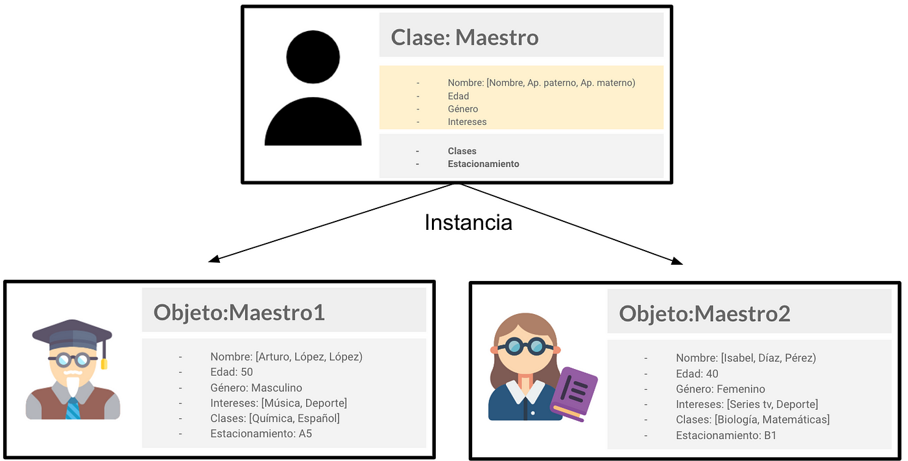

La **abstracción** es el proceso de definir el grado de detalle que una clase debe contener. A mayor detalle, menor abstracción y viceversa.


La **modularidad** se refiere al proceso de dividir un sistema complejo en diferentes sub-elementos (módulos) que contemplan funciones o características afines.

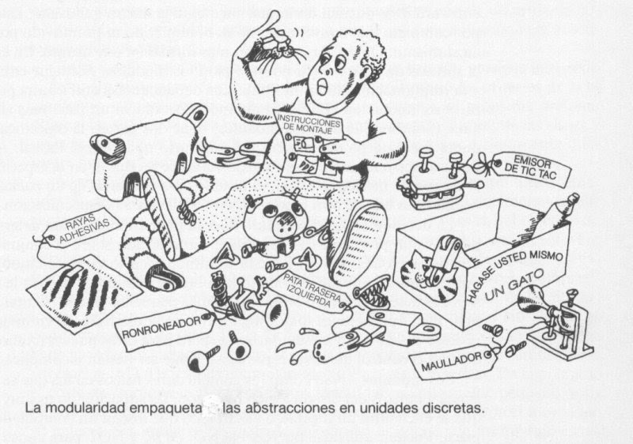

El **encapsulamiento** es el proceso por el cual ciertos detalles de implementación son ocultados al usuario final y solamente se muestra lo necesario para poder interactuar con los objetos y/o clases.


La **herencia** es el mecanismo por el cual las clases pueden compartir sus atributos y métodos, permitiendo así poder crear una jerarquía de objetos con rasgos comunes, y agregar nuevos comportamientos y atributos, así como de redefinir los heredados por las clases base.

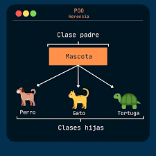

El **polimorfismo** es una propiedad que permite a los objetos interactuar de diferentes formas según sea el contexto de la ejecución. Las formas más comunes de polimorfismo se presentan en la Sobrecarga de métodos y la Sobre-escritura.

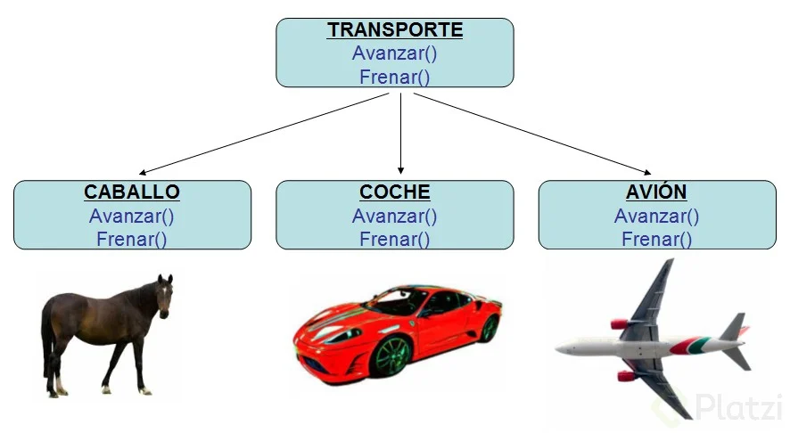

### 1.2 Lenguaje de modelado unificado: diagrama de clases

UML es un lenguaje de modelado estándar que nos permite representar visualmente los diferentes elementos que componen un sistema.

Para representar una clase, se puede utilizar la notación UML que se muestra a continuación:

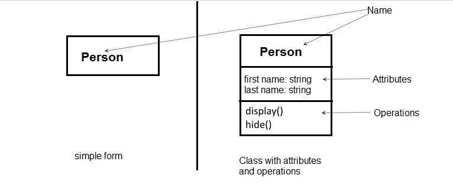

Un diagrama de clases muestra un conjunto de clases, interfaces y colaboraciones, así como sus relaciones. Gráficamente, un diagrama de clases es una colección de nodos y arcos.

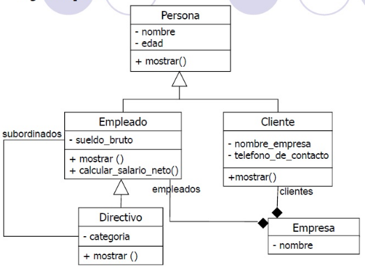

Los diagramas de clases se utilizan para modelar la vista de diseño estática de un sistema. Esto incluye, principalmente, modelar el vocabulario del sistema, modelar las colaboraciones o modelar los esquemas.

## Unidad 2: Clases y objetos

Esta unidad se centra en la definición e implementación de clases y objetos permitiendo al estudiante adquirir las competencias fundamentales de la programación orientada a objetos.

### 2.1 Declaración de clases: atributos, métodos, encapsulamiento

La declaración de una clase consiste en definir la estructura de la misma.

Veamos unos ejemplos simples en diferentes lenguajes.

Java:

```java
class Persona {}
```

Python:

```python
class Persona:
  pass
```

Ruby:

```ruby
class Persona
end
```

Javascript:

```js
class Persona {}
```

C++:

```cpp
class Persona {};
```

Con lo anterior, solamente hemos definido el nombre de la clase. Vamos a agregar los atributos `nombre`, `edad` y `vive` con sus tipos de datos correspondientes.

Java:

```java
class Persona {
  String nombre;
  int edad;
  boolean vive;
}
```

Python:

```python
class Persona:
    def __init__(self, nombre, edad):
        self.nombre = nombre
        self.edad = edad
        self.vive = True
```

Ruby:

```ruby
class Persona
  attr_accessor :nombre, :edad, :vive
end
```

Javascript:

```js
class Persona {
  nombre;
  edad;
  vive;
}
```

C++:

```cpp
#include <string>

class Persona {
public:
    std::string nombre;
    int edad;
    bool vive;
};
```

> :eyes: Observe que en algunos lenguajes no es necesario indicar explícitamente el tipo de dato, ya que el lenguaje resuelve de manera dinámica el tipo necesario

Los atributos nos permiten almacenar información pertinente sobre cada objeto que se cree a partir de la clase, las cuales pueden (o no) ser modificadas durante la ejecución del programa.

Por último vamos a definir algunos métodos básicos, como por ejemplo `saludar`, `incrementarEdad` y `morir`.

Java:

```java
class Persona {
  String nombre;
  int edad;
  boolean vive;

  void saludar() {
    System.out.println("Hola, mi nombre es " + nombre);
  }

  void incrementarEdad() {
    edad = edad + 1;
  }

  void morir() {
    vive = false;
  }
}
```

Python:

```python
class Persona:
    def __init__(self, nombre, edad):
        self.nombre = nombre
        self.edad = edad
        self.vive = True

    def saludar(self):
        print(f"Hola, mi nombre es {self.nombre}")

    def incrementar_edad(self):
        self.edad = self.edad + 1

    def morir(self):
        self.vive = False
```

Ruby:

```ruby
class Persona
  attr_accessor :nombre, :edad, :vive

  def saludar
    puts "Hola, mi nombre es #{@nombre}"
  end

  def incrementar_edad
    @edad = @edad + 1
  end

  def morir
    @vive = false
  end
end
```

Javascript:

```js
class Persona {
  nombre;
  edad;
  vive;

  saludar() {
    console.log(`Hola, mi nombre es ${this.nombre}`);
  }

  incrementarEdad() {
    this.edad = this.edad + 1;
  }
}
```

C++:

```cpp
#include <iostream>
#include <string>

class Persona {
public:
    std::string nombre;
    int edad;
    bool vive;

    void saludar() {
      std::cout << "Hola, mi nombre es " << nombre << std::endl;
    }

    void incrementarEdad() {
      edad++;
    }

    void morir() {
      vive = false;
    }
};
```

Cada lenguaje define la manera en que los métodos son declarados, así como si es necesario especificar un valor de retorno, tal es el caso de Java y C++, los cuales para el caso de no retornar un valor se debe emplear la palabra reservada `void` (vacío).

Uno de los problemas con las declaraciones anteriores es que los atributos y métodos son accesibles por otras clases, pudiendo modificar y leer sus valores directamente, lo cual puede romper el encapsulamiento de la clase.

Por ejemplo:

Java:

```java
class Persona {
  // Atributos y métodos
}

// Otra clase
public class Programa {
  public static void main(String[] args) {
    Persona juan = new Persona();
    juan.saludar();
    juan.nombre = "Pedro";
    juan.edad = -10;
    juan.vive = true;
    juan.saludar();

    juan.morir();
    juan.saludar();
    juan.vive = true;
  }
}
```

Python:

```python
# Ticket #28
```

Ruby:

```ruby
# Ticket #29
```

Javascript:

```js
class Persona {
  nombre;
  edad;
  vive;

  saludar() {
    console.log(`Hola, mi nombre es ${this.nombre}`);
  }

  incrementarEdad() {
    this.edad = this.edad + 1;
  }

  morir() {
    this.vive = false;
  }
}

const juan = new Persona();
console.log(juan);
juan.saludar();
juan.nombre = "Pedro";
juan.edad = -10;
juan.vive = true;
juan.saludar();
console.log(juan);
juan.morir();
console.log(juan);
juan.saludar();
juan.vive = true;
console.log(juan);
```

C++:

```cpp
// Ticket #31
```

En este ejemplo, es posible escribir directamente los valores de los atributos por cualquier valor sin que existan restricciones, como es el caso del atributo `vive`, que puede ser modificado una vez que el método morir ha sido ejecutado.

Una mejor manera de escribir las clases es mantener los atributos privados y sólo tener métodos para acceder a ellos para agregar las validaciones correspondientes.

Java:

```java
class Persona {
  private String nombre;
  private int edad;
  private boolean vive = true;

  // otros métodos

  void morir() {
    if (vive) {
      vive = false;
    }
  }

  void saludar() {
    if (vive) {
      System.out.println("Hola, mi nombre es " + nombre);
    } else {
      System.out.println("DEP: " + nombre);
    }
  }
}

// Otra clase
public class Programa {
  public static void main(String[] args) {
    Persona juan = new Persona("Juan", 30);
    juan.saludar();
    juan.morir();
    juan.saludar();
  }
}
```

Python:

```python
# Ticket #32
```

Ruby:

```ruby
# Ticket #33
```

Javascript:

```js
"use strict";

class Persona {
  #nombre;
  #edad;
  #vive;

  constructor(nombre, edad) {
    this.#nombre = nombre;
    this.#edad = edad;
    this.#vive = true;
    Object.seal(this);
  }

  get nombre() {
    return this.#nombre;
  }

  set nombre(nuevoNombre) {
    throw new Error("No se puede asignar un nuevo nombre");
  }

  get edad() {
    return this.#edad;
  }

  get vive() {
    return this.#vive;
  }

  set vive(vivePersona) {
    throw new Error("No se puede establecer si vive directamente");
  }

  set edad(nuevaEdad) {
    throw new Error("No se puede asignar edad directamente");
  }

  saludar() {
    if (this.#vive) {
      console.log(
        `Hola, mi nombre es ${this.nombre} y tengo ${this.edad} años`
      );
    } else {
      console.log(
        `Hola, mi nombre fue ${this.nombre} y morí a los ${this.edad} años`
      );
    }
  }

  incrementarEdad() {
    this.#edad = this.#edad + 1;
  }

  morir() {
    this.#vive = false;
  }
}

const juan = new Persona("Juan", 30);

juan.saludar();
juan.incrementarEdad();
juan.saludar();
juan.morir();
juan.saludar();

// Esta línea regresa un error ya que el objeto no admite nuevas propiedades
// juan.otro = "Otro atributo"

console.log(juan.nombre);
```

C++:

```cpp
// Ticket #36
```

En esta nueva versión de la clase `Persona`, los atributos son acompañados de la palabra clave `private`, la cual nos indica que solamente pueden ser accedidos dentro de la misma clase, pero no fuera de ella, y solo es posible interactuar a traves de los métodos de la misma.

#### Práctica: Crear la clase Persona en diferentes lenguajes

Instrucciones

1. Crear una carpeta llamada `practicas/unidad2` en el repositorio personal
2. Dentro de la carpeta crear las siguientes carpetas y archivos correspondientes:

   - :file_folder: java
     - Persona.java
   - :file_folder: ruby
     - Persona.rb
   - :file_folder: python
     - Persona.py
   - :file_folder: js
     - Persona.js
   - :file_folder: cpp
     - Persona.cpp

3. Escribir el código correspondiente en cada archivo y ejecutarlo.

### 2.2 Instanciación de una clase

Instanciar se refiere al proceso de creación de un objeto a partir de una clase. Esto se logra a traves del uso del (los) constructor(es) de la clase. Ejemplos:

Java:

```java
Persona juan = new Persona("Juan", 30);
// o alternativamente
var juan = new Persona("Juan", 30);
```

Python:

```python
juan = Persona("Juan", 30)
```

Ruby:

```ruby
juan = Persona.new("Juan", 30)
```

Javascript:

```js
const juan = new Persona("Juan", 30);
```

C++:

```cpp
Persona juan("Juan", 30);
```

### 2.3 Referencia al objeto actual

Al momento de crear y manipular un objeto o instancia de una clase, es necesario en algunos casos hacer referencia asimismo dentro de la clase.

Para ello se utiliza una palabra reservada definida por el lenguaje. Aquí algunos ejemplos:

Java:

```java
class Persona {
  String nombre;

  // otro código ...

  boolean esMayorQue(Persona otraPersona) {
    // Utilizamos la palabra this para hacer referencia al objeto actual
    // No es requerida a menos que el nombre de la variable o parámetro tenga conflicto con el atributo
    return this.edad > otraPersona.edad;
  }
}

// Ejemplo en uso

Persona juan = new Persona("Juan", 20);
Persona pedro = new Persona("Pedro", 15);

if (pedro.esMayorQue(juan)) {
  System.out.println("Pedro es mayor que Juan");
} else if (juan.esMayorQue(pedro)) {
  System.out.println("Juan es mayor que Pedro");
} else {
  System.out.println("Ambos tienen la misma edad");
}

```

Python:

```python
class Persona:
  # otro código...

  # Se usa la palabra self para hacer referencia al objeto actual
  def es_mayor_que(self, otra_persona):
    return self.edad > otra_persona.edad

# Ejemplo de uso
juan = Persona("Juan", 20)
pedro = Persona("Pedro", 15)

if juan.es_mayor_que(pedro):
  print("Juan es mayor que Pedro")
elif pedro.es_mayor_que(juan):
  print("Pedro es mayor que Juan")
else:
  print("Ambos tienen la misma edad")

```

Ruby:

```ruby
class Persona
  # otro código

  # se usa la palabra self para hacer referencia al objeto actual
  def es_mayor_que(otra_persona)
    return self.edad > otra_persona.edad
  end

  # es posible acceder a los atributos utilizando un @ antes del nombre del atributo
  def es_mayor_de_edad
    @edad > 18 # la palabra return es opcional
  end

end

# Ejemplo de uso
juan = Persona.new("Juan", 20)
pedro = Persona.new("Pedro", 15)

if juan.es_mayor_que(pedro)
  puts "Juan es mayor que Pedro"
elsif pedro.es_mayor_que juan # No es necesario poner el paréntesis para llamar la función
  puts "Pedro es mayor que Juan"
else
  puts "Ambos tienen la misma edad"
end

```

Javascript:

```js
class Persona {
  constructor(nombre, edad) {
    this.nombre = nombre;
    this.edad = edad;
  }

  esMayorQue(otraPersona) {
    return this.edad > otraPersona.edad;
  }
}

// Ejemplo de uso
const juan = new Persona("Juan", 20);
const pedro = new Persona("Pedro", 15);

if (pedro.esMayorQue(juan)) {
  console.log("Pedro es mayor que Juan");
} else if (juan.esMayorQue(pedro)) {
  console.log("Juan es mayor que Pedro");
} else {
  console.log("Ambos tienen la misma edad");
}
```

C++:

```cpp
// Ticket #38
```

### 2.4 Métodos: declaración, mensajes, paso de parámetros, retorno de valores

En la programación orientada a objetos (POO), un método es una función o procedimiento asociado a un objeto particular o a una clase. Los métodos son una de las características clave de la POO y se utilizan para representar el comportamiento de los objetos y las operaciones que pueden realizar.

Los métodos son una parte fundamental de la POO y se utilizan para modelar el comportamiento de objetos en un programa. Permiten la modularidad, la reutilización de código y la representación de comportamiento específico de objetos, lo que hace que la programación orientada a objetos sea una metodología poderosa y flexible para el desarrollo de software.

### Declaración de métodos

Cada lenguaje define su sintaxis para declarar métodos, pero de manera general estos son los elementos principales:

- **Nombre del método**: por lo general se utilizan verbos en infinitivo que indican una acción tales como: `imprimir`, `mostrar`, `dibujar`, etc... Normalmente son escritos en minúsculas, pero en caso de contener 2 o más palabras se puede usar la notación camel case (ejemplo: `imprimirReporte`) o la notación snake case (ejemplo: `imprimir_reporte`).

- **Visibilidad**: Algunos lenguajes permiten definir la visibilidad de los métodos a traves de palabras reservadas como `private`, `protected`, `public`, o a traves de otros mecanismos.

- **Tipo de método**: Algunos lenguajes permiten definir métodos de instancia o métodos de clase, siendo estos últimos definidos por la palabra clave `static`.

- **Parámetros**: Un método puede contener 0 o multiples parámetros siendo el límite definido por el lenguaje. Normalmente se busca que la cantidad de parámetros no exceda de 4 para su facilidad de uso.

  > Nota: Al momento de usar un método y pasar los valores actuales de uso, a estos se les denomina **Argumentos**

- **Tipo de retorno**: En algunos lenguajes es requerido definir el tipo de retorno explícitamente, como es el caso de Java y C++. En el caso de que no exista un valor de retorno algunos lenguajes utilizan el tipo `void`.

- **Cuerpo del método**: Aquí es donde se definen las operaciones o algoritmos propios del método. Normalmente un método debe ser concreto y cumplir solamente una única responsabilidad.

A continuación se muestran algunos ejemplos en diferentes lenguajes

Java:

```java
public class Persona {

  public void saludar() {
    // aquí va el cuerpo del método
  }

  public static void metodoEstatico() {
    System.out.println("Este método se puede invocar sin necesidad de un objeto");
    // No es posible utilizar la palabra this dentro de un método estático
    // this.saludar();
  }

  // También es posible pasar objetos de clases que hemos creado nosotros
  public boolean meGusta(Comida comida) {
    return this.comidasFavoritas.contains(comida);
  }

  private String contarSecreto() {
    return "Solo yo puedo invocar este método";
  }
}

// Uso

Persona juan = new Persona("Juan", 20);

juan.addComidaFavorita(chocolate);
juan.addComidaFavorita(pizza);

// Este método puede ser invocado desde cualquier lugar ya que es público
juan.saludar();

// No es necesario tener una instancia de clase para usar este método
Persona.metodoEstatico();

// Aunque es valido usar:

juan.metodoEstatico();

// Esto nos daria un error de compilación, ya que el método es privado
String secreto = juan.contarSecreto();

// Aquí vemos el uso de parámetros
boolean gustaBrocoli = juan.meGusta(brocoli);

```

Python:

En Python, no existen clases públicas o privadas de la misma manera que en algunos otros lenguajes de programación, como Java o C++. Python sigue el principio de "consentimiento del adulto" en lugar de "imposición", lo que significa que no restringe el acceso a los miembros de una clase. En su lugar, confía en convenciones y buenas prácticas para lograr la encapsulación y proteger la privacidad de los miembros de la clase.

Sin embargo, Python utiliza una convención para indicar que ciertos miembros de una clase no deben ser accedidos desde fuera de la clase. Esta convención es la siguiente:

Los miembros (atributos o métodos) cuyos nombres comienzan con un guion bajo (`_`) se consideran "privados" y no deberían ser accedidos directamente desde fuera de la clase. Por ejemplo, `_mi_atributo` o `_mi_metodo()`.

Los miembros cuyos nombres comienzan y terminan con dos guiones bajos (`__`) tienen un comportamiento de "name mangling" y son más difíciles de acceder desde fuera de la clase. Por ejemplo, `__mi_atributo` se convierte en `_nombre_de_clase__mi_atributo`.
Es importante destacar que estas convenciones son solo un acuerdo entre los desarrolladores y el lenguaje en sí no impide el acceso a estos miembros de ninguna manera. Si bien puedes acceder a los miembros "privados" de una clase en Python, es una práctica recomendada no hacerlo directamente y respetar la privacidad de los atributos y métodos.

En resumen, Python no implementa explícitamente el concepto de clases públicas o privadas, pero fomenta la encapsulación y la protección de miembros de clase a través de convenciones y buenas prácticas de programación.

```python
class Persona:
  atributo_de_clase = 42

  def saludar():
    # aquí va el cuerpo del método

  @staticmethod
  def metodo_estatico():
    print("Este es un método estático")

  def me_gusta(self, comida):
    return comida in self.comidas_favoritas

  def __contar_secreto():
    return "Solo yo puedo invocar este método"

  @classmethod
  def metodo_de_clase(cls):
    print(f"Este es un método de clase. El valor del atributo de clase es {cls.atributo_clase}")


# Uso

juan = Persona("Juan", 20)
juan.add_comida_favorita(chocolate)
juan.add_comida_favorita(pizza)

# Saludar puede ser invocado desde cualquier lugar
juan.saludar();

# Llamada al método estático desde la clase
Persona.metodo_estatico()
# Llamada desde el objeto

juan.metodo_estatico()

# Intentar acceder al método privado generará un error:
secreto = juan.__contar_secreto();

# Método que recibe un parámetro
gusta_brocoli = juan.me_gusta(brocoli);

# Llamando a método de clase
Persona.metodo_de_clase()
juan.metodo_de_clase

```

Ruby:

```ruby
class Persona
  def initialize(nombre = "SinNombre")
    @nombre = nombre
    @comida_favorita = []
  end

  def saludar
    puts "Hola, soy #{@nombre}"
  end

  def agegar_comida_favorita(comida)
    @comida_favorita << comida
  end

  def mostrar_comida_favorita
    puts "#{@nombre} le gusta "
    @comida_favorita.each do |comida|
      puts "- #{comida}"
    end
  end
end

# Uso
# Se crea instancia de Persona
personaConNombre = Persona.new("Jacob")
# Llama el metodo saludar
personaConNombre.saludar
# Llama al metodo agregar comida favorita
personaConNombre.agregar_comida_favorita("Pastel")
personaConNombre.agregar_comida_favorita("Helado")
# Llama al metodo mostrar comida favorita
personaConNombre.mostrar_comida_favorita

# Se crea instancia de Persona sin nombre
personaSinNombre = Persona.new
# Llama el metodo saludar
personaSinNombre.saludar
# Llama al metodo agregar comida favorita
personaSinNombre.agregar_comida_favorita("Elotes")
personaSinNombre.agregar_comida_favorita("Papitas")
# Llama al metodo mostrar comida favorita
personaSinNombre.mostrar_comida_favorita
```

Javascript:

```js
class Persona {
  comidasFavoritas = [];

  saludar() {
    console.log("Hola, soy una persona");
  }

  static metodoEstatico() {
    console.log("Método estático invocado");
  }

  meGusta(comida) {
    return this.comidasFavoritas.includes(comida);
  }

  agregarComidaFavorita(comida) {
    this.comidasFavoritas.push(comida);
  }

  #contarSecreto() {
    return "Este es un método privado";
  }
}

// main.js

const persona = new Persona();

persona.saludar();

persona.agregarComidaFavorita("chocolate");
persona.agregarComidaFavorita("pizza");

console.log("Me gusta el chocolate?", persona.meGusta("chocolate"));
console.log("Me gusta el brocoli?", persona.meGusta("brocoli"));

Persona.metodoEstatico();
// Tratar de ejecutar un método privado
// persona.#contarSecreto()
```

C++:

```cpp
// Ticket #41
```

### 2.5 Constructores y destructores declaración, uso y aplicaciones

En programación orientada a objetos (POO), un constructor y un destructor son métodos especiales que se utilizan para inicializar y liberar recursos de un objeto, respectivamente. Estos conceptos son especialmente relevantes en lenguajes de programación que gestionan la asignación y liberación de memoria de manera explícita, como C++.

#### Constructor

Un constructor es un método especial que se llama automáticamente cuando se crea una instancia (objeto) de una clase.
Su función principal es inicializar los atributos del objeto y realizar cualquier tarea de inicialización necesaria.
Los constructores suelen recibir argumentos que se utilizan para configurar el objeto durante la creación.
Los constructores tienen el mismo nombre que la clase y no tienen un tipo de retorno explícito.

En muchos lenguajes, una clase puede tener varios constructores con diferentes parámetros, lo que se conoce como sobrecarga de constructores.

Veamos algunos ejemplos:

Java:

```java

public class Boton {
  // otras propiedades y atributos ...

  // Constructor sin argumentos
  public Boton() {
    this("Boton", 100, 300);
  }
  // Constructor con un argumento
  public Boton(String texto) {
    this(texto, 100, 300);
  }

  private Boton(String texto, int alto, int ancho) {
    this.texto = texto;
    this.alto = alto;
    this.ancho = ancho;
  }
}

// Uso

Boton boton1 = new Boton();
Boton boton2 = new Boton("Boton 2");

// Esto produce un error ya que no se puede acceder al constructor privado
Boton boton3 = new Boton("Boton 3", 50, 400);
```

Python:

```python
class Boton:
  def __init__(self, texto = "Boton", alto = 100, ancho = 300)
    self.texto = texto
    self.alto = alto
    self.ancho = ancho

# Uso

if __name__ == "__main__":
  boton1 = Boton()
  boton2 = Boton("Boton 2")
  boton3 = Boton("Boton 3", 50, 400)
```

Ruby:

```ruby
# Boton.rb
class Boton
  def initialize(texto = "Boton", alto = "100", ancho = 200)
    @texto = texto
    @alto = alto
    @ancho = ancho
  end

  def imprimir_datos()
    puts("Texto='#{@texto}', Alto=#{@alto}, Ancho=#{@ancho}")
  end
end

# main.rb
botonSimple = Boton.new()
botonSimple.imprimir_datos()

botonSoloTexto = Boton.new("Boton sólo texto")
botonSoloTexto.imprimir_datos()

botonTodosLosArgumentos = Boton.new("Boton con todos los argumentos", 30, 40)
botonTodosLosArgumentos.imprimir_datos()
```

Javascript:

```js
class Boton {
  constructor(texto = "Boton", alto = 200, ancho = 400) {
    this.texto = texto;
    this.alto = alto;
    this.ancho = ancho;
  }
}
const botonSimple = new Boton();
console.log(botonSimple);

const botonDeTexto = new Boton("Mi boton coloca el texto");
console.log(botonDeTexto);

const botonDe1Valor = new Boton("Mi boton tiene un valor", 150);
console.log(botonDe1Valor);

const botonDe2Valores = new Boton("Mi boton tiene 2 valores", 200, 86);
console.log(botonDe2Valores);
```

C++:

```cpp
#include <iostream>

#include <string>

class Boton {
  private: std::string texto;
  private: int alto;
  private: int ancho;
  public:
    // Constructor por defecto
    Boton(): texto("BotonSA"), alto(100), ancho(100) {}
    // Constructor con argumentos
    Boton(std::string txt, int al, int an): texto(txt), alto(al), ancho(an) {}

    void imprimirDatos() {
      std::cout << "Texto: " << texto << std::endl;
      std::cout << "Alto: " << alto << std::endl;
      std::cout << "Ancho: " << ancho << std::endl;
    }
};
int main() {
  // Usa el constructor sin argumentos
  Boton botonSinArgumentos;
  botonSinArgumentos.imprimirDatos();
  // usa el constructor con argumentos
  Boton botonConArgumentos("botonCA", 200, 200);
  botonConArgumentos.imprimirDatos();
  return 0;
}
```

#### Destructor

Un destructor es un método especial que se llama automáticamente cuando un objeto se destruye o sale de ámbito.
Su función principal es liberar los recursos utilizados por el objeto, como memoria dinámica u otros recursos adquiridos durante la vida del objeto.

En algunos lenguajes, como C++, los destructores se utilizan para garantizar una limpieza adecuada y prevenir pérdidas de memoria y fugas de recursos.

En lenguajes de programación gestionados por recolección de basura, como Java o Python, la gestión de la memoria se realiza automáticamente, y los programadores no necesitan preocuparse por los destructores. En su lugar, se utilizan métodos de finalización o recolección de basura para liberar recursos.

```cpp
class MiClase {
public:
    MiClase() {
        // Constructor
    }

    ~MiClase() {
        // Destructor
        // Realizar tareas de limpieza aquí
    }
};
```

### 2.6 Sobrecarga de métodos

La sobrecarga de métodos en programación orientada a objetos (POO) es un concepto que permite definir múltiples métodos con el mismo nombre en una clase, pero con diferentes listas de argumentos (parámetros). En otras palabras, es la capacidad de una clase de tener varios métodos con el mismo nombre, pero cada uno de ellos acepta un conjunto distinto de parámetros.

La sobrecarga de métodos permite que una clase ofrezca diferentes funcionalidades o comportamientos basados en la cantidad o el tipo de argumentos que recibe. Esto hace que el código sea más flexible y fácil de usar, ya que los programadores pueden llamar al método con diferentes argumentos según sus necesidades.

En lenguajes de programación como Java o C++, la sobrecarga de métodos se basa en la firma del método, que incluye el nombre del método y la lista de tipos de parámetros. Los métodos sobrecargados deben tener el mismo nombre pero una firma de parámetros diferente.

Java:

```java
class Reservacion {

  void reservar(Date fechaInicio, Date fechaFin) {
    // lógica para reservar dentro de esas fechas
  }

  void reservar(Date fechaInicio, int numeroDeDias) {
    // lógica para reservar desde una fecha dada y calcular la fecha fin en base al # de días
  }
}

```

C++:

```cpp
#include <iostream>

class EjemploSobrecarga {
public:
    void mostrar(int numero) {
        std::cout << "Número: " << numero << std::endl;
    }

    void mostrar(std::string texto) {
        std::cout << "Texto: " << texto << std::endl;
    }
};

int main() {
    EjemploSobrecarga objeto;

    objeto.mostrar(42);
    objeto.mostrar("Hola, sobrecarga!");

    return 0;
}
```

En Python, Ruby o Javascript no existe el concepto como tal, si no que se tendría que determinar el tipo de dato dentro del método

Javascript:

```js
class Reservacion {
  reservar(fechaInicio, parametro) {
    if (typeof parametro === "number") {
      // lógica para cuando se pasa un número
    } else {
      // lógica para cuando se pasa otro dato
    }
  }
}
```

Python:

```python
# Ticket #9: Agregar ejemplo de sobrecarga de métodos en Python
```

Ruby:

```ruby
# Ticket #10: Agregar ejemplo de sobrecarga de métodos en Ruby
```

### 2.7 Sobrecarga de operadores: Concepto y utilidad, operadores unarios y binarios

La sobrecarga de operadores o también llamada "Operator Overloading" es una funcionalidad que algunos lenguajes utilizan para definir más de una operación para un operador dado.

El ejemplo más común es el operador `+`, que dependiendo de los operandos, realiza una funcionalidad distinta.

Veamos un ejemplo en Java:

Java:

```java
var resultado1 = 145 + 25;
System.out.println(resultado1);


var resultado2 = 145 + "25";
System.out.println(resultado2);
```

Ruby:

```ruby
# Ticket #12: Agregar ejemplo de sobrecarga de operadores en Ruby
```

Javascript:

```js
const sumaEnteros = 10 + 20;
console.log(sumaEnteros);
// salida -> 30

const sumaEnteroString = 10 + "20";
console.log(sumaEnteroString);
// salida -> 1020
```

También es posible redefinir los operadores utilizando librerías externas, tal como se muestra en el siguiente [enlace](https://www.delftstack.com/es/howto/javascript/javascript-operator-overloading/).

En algunos lenguajes como C++, C# o Python, es posible redefinir las operaciones aritméticas de clases personalizadas.

C++:

```cpp
#include <iostream>

class NumeroComplejo {
public:
    NumeroComplejo(double real, double imaginario) : real(real), imaginario(imaginario) {}

    NumeroComplejo operator+(const NumeroComplejo& otro) {
        return NumeroComplejo(real + otro.real, imaginario + otro.imaginario);
    }

    void mostrar() {
        std::cout << real;
        if (imaginario >= 0) {
            std::cout << " + " << imaginario << "i";
        } else {
            std::cout << " - " << -imaginario << "i";
        }
        std::cout << std::endl;
    }

private:
    double real;
    double imaginario;
};

int main() {
    NumeroComplejo numero1(3.0, 4.0);  // Crea un número complejo (3 + 4i)
    NumeroComplejo numero2(1.5, -2.5); // Crea otro número complejo (1.5 - 2.5i)

    NumeroComplejo suma = numero1 + numero2; // Suma los números complejos

    std::cout << "Número 1: ";
    numero1.mostrar(); // Muestra el primer número complejo
    std::cout << "Número 2: ";
    numero2.mostrar(); // Muestra el segundo número complejo
    std::cout << "Suma: ";
    suma.mostrar(); // Muestra el resultado de la suma

    return 0;
}

```

Python:

```python
class NumeroComplejo:
    def __init__(self, real, imaginario):
        self.real = real
        self.imaginario = imaginario

    def __add__(self, otro):
        suma_real = self.real + otro.real
        suma_imaginario = self.imaginario + otro.imaginario
        return NumeroComplejo(suma_real, suma_imaginario)

    def mostrar(self):
        if self.imaginario >= 0:
            print(f"{self.real} + {self.imaginario}i")
        else:
            print(f"{self.real} - {abs(self.imaginario)}i")
```

C#:

```cs
using System;

class NumeroComplejo
{
    private int real;
    private int imaginaria;

    public NumeroComplejo(int real, int imaginaria)
    {
        this.real = real;
        this.imaginaria = imaginaria;
    }

    public void Imprimir()
    {
        Console.WriteLine("(" + this.real + ", " + this.imaginaria + ")");
        Console.WriteLine();
    }

    public static NumeroComplejo operator +(NumeroComplejo a, NumeroComplejo b)
    {
        return new NumeroComplejo(a.real + b.real, a.imaginaria + b.imaginaria);
    }
}

public class Programa
{
    public static void Main(string[] args)
    {
        NumeroComplejo c1 = new NumeroComplejo(10, 20);
        NumeroComplejo c2 = new NumeroComplejo(20, 30);
        NumeroComplejo suma = c1 + c2;
        c1.Imprimir();
        c2.Imprimir();
        suma.Imprimir();

        // salida
        // (10, 20)
        // (20, 30)
        // (30, 50)
    }
}
```

#### Práctica: Contribuir con el proyecto de documentación

Instrucciones:

1. Abra una terminal
2. Si aun no tiene su carpeta de proyectos, ejecute el siguiente comando

```
mkdir -p ~/projects/tecnm/programacion-orientada-a-objetos
```

3. Entre a su carpeta de proyectos

```
cd ~/projects/tecnm/programacion-orientada-a-objetos
```

4. Clone el repositorio de la documentación de la materia

```
git clone https://github.com/TecnologicoDeDelicias/programacion-orientada-a-objetos.git documentacion-materia
```

> En caso de usar SSH utilizar el comando `git clone git@github.com:TecnologicoDeDelicias/programacion-orientada-a-objetos.git documentacion-materia`

5. Entre a la carpeta de la documentación de la materia recién creada

```
cd documentacion-materia
```

6. Verifique que se encuentra dentro del branch main

```
git branch
```

7. Presione la tecla `q` para salir del comando anterior
8. Configure su nombre de usuario y correo electrónico

```
git config user.name "Nombre Apellido"
git config user.email "correo"
```

> Usar la opción `--global` en caso de que aplique para todos los proyectos

9. Vaya a la [sección de issues](https://github.com/TecnologicoDeDelicias/programacion-orientada-a-objetos/issues) de la documentación y seleccione un ticket asignándolo a su usuario en Github

10. Cree un branch usando como referencia el número de ticket y descripción

```
git checkout -b 123-descripcion-corta
```

11. Modifique la sección del `README.md` que hace referencia su ticket según lo solicitado

12. Haga un commit de sus cambios con el siguiente formato:

```
git commit -m "Ticket #123: Descripción de los cambios"
```

13. Haga un push de su branch utilizando el siguiente comando:

```
git push --set-upstream origin $(git_current_branch)
```

14. Del comando anterior va a mostrarle una URL para crear un Pull Request. Copie y pegue dicha URL en un navegador.

15. En el título del Pull Request ingrese el mismo mensaje que el commit del paso 12.

16. En el comentario del Pull Request agregue una descripción breve de los cambios.

17. En la lista de revisores (Reviewers) seleccione al profesor y a algún compañero de clase.

18. En el campo de Asignado (Assignee) seleccione su propio usuario.

19. Asegure que el branch destino sea main, revise los cambios y de clic en el botón **Create Pull Request**.

20. Notifique a los revisores del Pull Request la URL del mismo y espere por la retroalimentación

21. En caso de recibir feedback, realice los cambios solicitados, haga un nuevo commit y un push

```
git add .
git commit -m "Ticket #123: Cambios propuestos en Pull Request"
git push
```

22. Una vez aprobados los cambios por los revisores procedemos a hacer Merge dado clic en el botón de **Merge Pull Request**

## Unidad 3: Herencia

Esta unidad tiene como propósito la creación de objetos que incorporen propiedades y métodos de otros objetos, construyéndolos a partir de éstos sin necesidad de reescribirlo todo.

### 3.1 Definición: Clase base, Clase derivada

Cuando pensamos en las clases y objetos que forman parte de cualquier contexto, es posible que encontremos similitudes entre las mismas, llegando el punto que una gran parte de ciertos atributos y métodos son idénticos o contienen un patrón similar.

Por ejemplo, imaginemos una aplicación que contiene elementos de interfaz gráfica, como puede ser botones, etiquetas, cuadros de texto, etc..

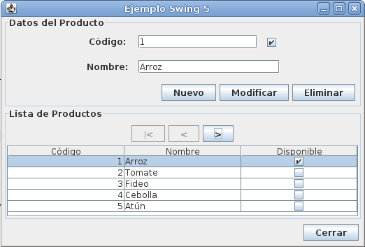

Claramente podemos deducir que dichos elementos tienen diferencias notables en la manera en que se muestren al usuario, y la forma en que este interactúa con ellos. Pero de igual manera, es posible que ciertos atributos y métodos se repitan como `nombre`, `texto`, `alto` y `dibujar`, entre otros.

Es por ello que es posible crear una nueva clase que contenga dichos atributos y métodos repetidos y hacer que las clases hereden de esta para eliminar dicha duplicidad.

Se le denomina **Clase Base** a la clase que contiene un mayor grado de abstracción que otra, y está es usada como punto inicial para crear otras clases. En nuestro ejemplo, sería la clase `ComponenteInterfazGrafica`.

Por otro lado, a una ckase que hereda los atributos y métodos de otra es denominada como **Clase Derivada**. Siguiendo nuestro ejemplo anterior serían las clases `Boton`, `Etiqueta` y `CuadroDeTexto`.

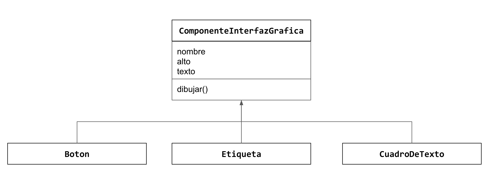

En Java, todas las clases heredan de manera implícita de la clase `Object`, la cual contiene algunos métodos base que todo objeto puede acceder de manera predeterminada.

Veamos ahora algunos ejemplos de como crear clases base y derivadas en los diferentes lenguajes.

Java:

```java
class Base {}

class Derivada extends Base {}
```

Python:

```python
class Base:
  pass

class Derivada(Base):
  pass
```

Ruby:

```ruby
class Base
end

class Derivada < Base
end
```

C++:

```cpp
class Base {};

class Derivada: public Base {};
```

### 3.2 Clasificación: herencia simple, herencia múltiple

En algunos lenguajes como C++ es posible que una clase derivada tenga más de una clase base directa. A esto se le conoce como **Herencia Múltiple**. En el caso de que una clase derivada sólo tenga una clase base directa se le conoce como **Herencia Simple**.

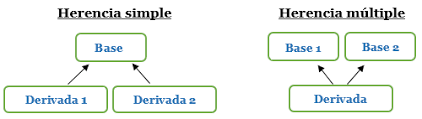

C++:

```cpp
class Base1 {};
class Base2 {};

class DerivadaMultiple: public Base1, public Base2 {};
```

Uno de los principales problemas que conlleva el uso de herencia múltiple es el la aparición de ambigüedades al momento de tener en diferentes clases base un atributo o método con el mismo nombre y firma respectivamente, ya que el compilador no puede determinar cual es el elemento que se desea utilizar para la clase derivada. Esto es conocido como el **Problema del Diamante**, por su representación gráfica.

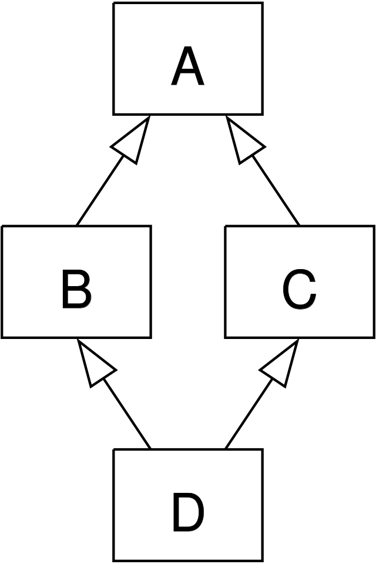

En lenguajes derivados o inspirados en C y C++, tales como Java, C# y Objective-C no se permite la herencia múltiple para evitar dicha ambigüedad, sin embargo es posible emular dicha propiedad a traves de la implementación de múltiples **interfaces**.

### 3.3 Reutilización de miembros heredados

Como se ha mencionado en el tema 3.1, una de las finalidades de implementar el mecanismo de herencia dentro de POO, es la reutilización de código. Veamos algunos ejemplos en los diferentes lenguajes:

Java:

```java
class Persona {
  void saludar() {
    System.out.println("Hola, soy una persona");
  }
}

class Estudiante extends Persona {
  void estudiar() {
    System.out.println("Estoy estudiando!!");
  }
}

class Docente extends Persona {
  void darClase() {
    System.out.println("Estoy dando clases!!");
  }
}

class Main {
  public static void main(String[] args) {
    Persona persona = new Persona();
    Estudiante estudiante = new Estudiante();
    Docente docente = new Docente();

    persona.saludar();
    estudiante.saludar();
    docente.saludad();

    // Todos imprimen "Hola, soy una persona"

    estudiante.estudiar();
    // ---> "Estoy estudiando!!"

    docente.darClase();
    // ---> "Estoy dando clases!!"

    // las siguientes lineas no compilarían
    // persona.estudiar(); // <-- la clase Persona no tiene el método estudiar
    // estudiante.darClase(); // <-- la clase Estudiante no tiene el método darClase

    // Todas las clases derivan directa o indirectamente de la clase Object

    System.out.println(persona.getClass().getName());
    System.out.println(estudiante.getClass().getName());
    System.out.println(docente.getClass().getName());
  }
}

```

<!-- Ticket #90: Ejemplo en Python ->

<!-- Ticket #91: Ejemplo en Ruby ->

<!-- Ticket #92: Ejemplo en Javascript ->

<!-- Ticket #93: Ejemplo en C++ ->

### 3.4 Referencia al objeto de la clase base

Similar a lo estudiado en el tema [2.3](#23-referencia-al-objeto-actual), es posible hacer referencia a los miembros definidos en la clase base dentro de la clase derivada. Esto nos permite utilizar dichos miembros explícitamente en caso de que se requiera.

Java:

```java
package practicas.unidad3.java;

class Persona {
  void saludar() {
    System.out.println("Saludo como persona");
  }
}

class Estudiante extends Persona {

  void estudiar() {
    // Podemos mandar a llamar al saludar de Persona utilizando la palabra reservada "super"
    // Aunque técnicamente no es necesario
    super.saludar();
    System.out.println("Estudiando duro para no reprobar...");
  }
}

class Main {
  public static void main(String[] args) {
    Estudiante estudiante = new Estudiante();
    estudiante.estudiar();
  }
}
```

Python:

```python
class Persona:
    def saludar(self):
        print("Saludo como persona")

class Estudiante(Persona):
    def estudiar(self):
        super().saludar()
        print("Estudiando duro para no reprobar...")

estudiante = Estudiante()
estudiante.estudiar()
```

Ruby:

```ruby
class Persona
  def saludar
    puts "Saludo como persona"
  end
end

class Estudiante < Persona
  def estudiar
    # En este ejemplo no usamos super, ya que en Ruby tiene otro uso: https://medium.com/rubycademy/the-super-keyword-a75b67f46f05
    saludar()
    puts "Estudiando duro para no reprobar"
  end
end

estudiante = Estudiante.new()
estudiante.estudiar()
```

Javascript:

```js
class Persona {
  saludar() {
    console.log("Saludo como persona");
  }
}

class Estudiante extends Persona {
  estudiar() {
    super.saludar();
    console.log("Estudiando duro para no reprobar...");
  }
}

const estudiante = new Estudiante();
estudiante.estudiar();
```

C++:

```cpp
#include <iostream>

class Persona {
public:
    void saludar() {
        std::cout << "Saludo como persona" << std::endl;
    }
};

class Estudiante: public Persona {
public:
    void estudiar() {
        // Podemos invocar el método de la clase base con el nombre de la clase y el operador de ámbito ::
        Persona::saludar();
        std::cout << "Estudiando duro para no reprobar..." << std::endl;
    }
};

int main() {
    Estudiante estudiante;
    estudiante.estudiar();

    return 0;
}
```

### 3.5 Constructores y destructores en clases derivadas

#### 3.5.1 Constructores en clases derivadas

Al instanciar objetos de clases derivadas se inicia una cadena de invocaciones a constructores en las cuales el constructor de la clase derivada, antes de realizar sus propias tareas, invoca (ya sea implícita o explícitamente) al constructor de su clase base. Similarmente, si la clase base fue derivada de otra clase, el constructor de la clase base debe invocar al constructor de la clase ubicada en el siguiente nivel superior de la jerarquía, y así sucesivamente.

Veamos algunos ejemplos.

Java:

```java
package practicas.unidad3.java;

class Persona {
  Persona() {
    System.out.println("Constructor de persona");
  }
}

class Estudiante extends Persona {
  Estudiante() {
    // aquí se hace una llamada explicita a super(), que es el constructor de la clase base

    System.out.println("Constructor de estudiante");
  }
}

class Main {
  public static void main(String[] args) {
    new Estudiante();

    // Se imprime
    // Constructor en Persona
    // Constructor en Estudiante
  }
}
```

Python:

```python
class Persona:
    def __init__(self):
        print("Constructor de persona")

class Estudiante(Persona):
    def __init__(self):
        # En Python debe llamarse explícitamente el constructor de la clase base si deseamos dicho comportamiento
        super().__init__()
        print("Constructor de estudiante")

estudiante = Estudiante()
```

Ruby:

```ruby
class Persona
  def initialize
    puts "Constructor de Persona"
  end
end

class Estudiante < Persona
  def initialize
    super
    puts "Constructor de Estudiante"
  end
end

estudiante = Estudiante.new()
```

Javascript:

```js
class Persona {
  constructor() {
    console.log("Constructor de persona");
  }
}

class Estudiante extends Persona {
  constructor() {
    // La llamada a super es obligatoria
    super();
    console.log("Constructor de estudiante");
  }
}

const estudiante = new Estudiante();
```

C++:

```cpp
#include <iostream>

class Persona {
public:
    Persona() {
        std::cout << "Constructor de Persona" << std::endl;
    }
};

class Estudiante: public Persona {
public:
    Estudiante() {
        std::cout << "Constructor de Estudiante" << std::endl;
    }
};

int main() {
    Persona persona;

    Estudiante estudiante;
    // Salida:
    // Constructor de Persona
    // Constructor de Persona
    // Constructor de Estudiante
    return 0;
}
```

#### 3.5.2 Destructores en clases derivadas

Cuando remueve de la memoria un objeto de una clase derivada, el recolector de basura invoca al destructor del objeto. Esto inicia una cadena de invocaciones a destructores, en donde el destructor de la clase derivada y los destructores de las clases bases directas e indirectas se ejecutan en orden inverso al que se ejecutaron los constructores, esto es, primero se ejecuta el destructor de la clase derivada y al final se ejecuta el destructor de la clase base ubicada en el nivel superior de la jerarquía. La ejecución de los destructores debe liberar todos los recursos que el objeto adquirió, antes de que el recolector de basura reclame la memoria de ese objeto.

Cuando el recolector de basura invoca al destructor de un objeto de una clase derivada, ese destructor realiza su tarea y después invoca al destructor de la clase base.

C++:

```cpp
#include <iostream>

class Persona {
public:
    Persona() {
        std::cout << "Constructor de Persona" << std::endl;
    }
    ~Persona() {
        std::cout << "Destructor de Persona" << std::endl;
    }
};

class Estudiante: public Persona {
public:
    Estudiante() {
        std::cout << "Constructor de Estudiante" << std::endl;
    }
    ~Estudiante() {
        std::cout << "Destructor de Estudiante" << std::endl;
    }
};

int main() {
    Estudiante estudiante;
    return 0;
    // salida:
    // Constructor de Persona
    // Constructor de Estudiante
    // Destructor de Estudiante
    // Destructor de Persona
}
```

### 3.6 Redefinición de métodos en clases derivadas

Una de las posibilidades que la herencia nos permite es poder redefinir el comportamiento de las clases bases en una clase derivada. Esto se conoce como **Sobre-escritura de métodos** y es una forma de implementar el Polimorfismo, el cuál será explicado con mayor detalle en la unidad 4.

Veamos algunos ejemplos:

Java

```java
package practicas.unidad3.java;

class Persona {
  void saludar() {
    System.out.println("Hola, soy una persona");
  }
}

class Docente extends Persona {

  // De manera opcional podemos agregar la anotación Override que indica que el método se ha redefinido
  @Override
  void saludar() {
    System.out.println("Hola, soy un docente");
    // Para llamar al método de la clase derivada lo podemos hacer utilizando super
    // super.saludar();
  }
}

class Main {
  public static void main(String[] args) {
    Persona persona = new Persona();
    persona.saludar();
    // --> "Hola, soy una persona"

    Docente docente = new Docente();
    docente.saludar();
    // --> "Hola, soy un docente"

}
}

````

Python:

```python
class Persona:
    def saludar(self):
        print("Hola, soy una persona")

class Docente(Persona):
    def saludar(self):
        print("Hola, soy un docente")
        # Si queremos usar el método de la clase base usamos super()
        # super().saludar()

persona = Persona()
persona.saludar()

docente = Docente()
docente.saludar()
````

Ruby:

```ruby
class Persona
  def saludar
    puts "Hola, soy una persona"
  end
end

class Docente < Persona
  def saludar
    puts "Hola, soy un docente"
    # Si queremos usar el método de la clase base usamos super
    # super
  end
end

persona = Persona.new()
persona.saludar()

docente = Docente.new()
docente.saludar()
```

Javascript:

```js
class Persona {
  saludar() {
    console.log("Hola, soy una persona");
  }
}

class Docente extends Persona {
  saludar() {
    console.log("Hola, soy un docente");
    // Si queremos usar el método de la clase base usamos super
    // super.saludar()
  }
}

const persona = new Persona();
persona.saludar();

const docente = new Docente();
docente.saludar();
```

C++:

```cpp
#include <iostream>

class Persona {
public:
    void saludar() {
        std::cout << "Hola, soy una persona" << std::endl;
    }
};

class Docente: public Persona {
public:
    void saludar() {
        std::cout << "Hola, soy un docente" << std::endl;
        // Llamamos al método saludar de la clase base
        // Persona::saludar();
    }
};

int main() {
    Docente docente;
    docente.saludar();
    return 0;
}
```

## Unidad 4: Polimorfismo

Esta unidad trata una de las características fundamentales de la programación orientada a objetos: el polimorfismo, que permite reutilizar métodos con el mismo nombre, pero con relación a la clase a la que pertenece cada uno, con comportamientos diferentes.

### 4.1 Definición

Tema por desarrollar

### 4.2 Clases abstractas: definición, métodos abstractos, implementación de clases abstractas, modelado de clases abstractas

Tema por desarrollar

### 4.3 Interfaces: definición, implementación de interfaces, herencia de interfaces

Tema por desarrollar

### 4.4 Variables polimórficas (plantillas): definición, uso y aplicaciones

Tema por desarrollar

### 4.5 Reutilización de código

Tema por desarrollar

## Unidad 5: Excepciones

En esta unidad se tratan situaciones excepcionales que se presentan en tiempo de ejecución.

### 5.1 Definición

Tema por desarrollar

### 5.2 Tipos de excepciones

Tema por desarrollar

### 5.3 Propagación de excepciones

Tema por desarrollar

### 5.4 Gestión de excepciones: manejo de excepciones, lanzamiento de excepciones

Tema por desarrollar

### 5.5 Creación y manejo de excepciones definidas por el usuario

Tema por desarrollar

## Unidad 6: Flujos y archivos

En esta unidad se aplican las operaciones necesarias para el manejo de archivos de texto y binarios, temas que se utilizarán en materias posteriores.

### 6.1 Definición

Tema por desarrollar

### 6.2 Clasificación: Archivos de texto y binarios

Tema por desarrollar

### 6.3 Operaciones básicas y tipos de acceso

Tema por desarrollar

### 6.4 Manejo de objetos persistentes

Tema por desarrollar

## Anexos

### Tabla comparativa de Lenguajes de Programación

|                      | Java          | Python           | Ruby                      | Javascript   | C++               |
| -------------------- | ------------- | ---------------- | ------------------------- | ------------ | ----------------- |
| **Primer aparición** | 1995          | Finales 80'      | 1995                      | 1995         | 1983              |
| **Creador**          | James Gosling | Guido van Rossum | Yukihiro "Matz" Matsumoto | Brendan Eich | Bjarne Stroustrup |
| **Tipo**             | Compilado     | Interpretado     | Interpretado              | Interpretado | Compilado         |
| **Tipado**           | Fuerte        | Débil            | Débil                     | Débil        | Fuerte            |
